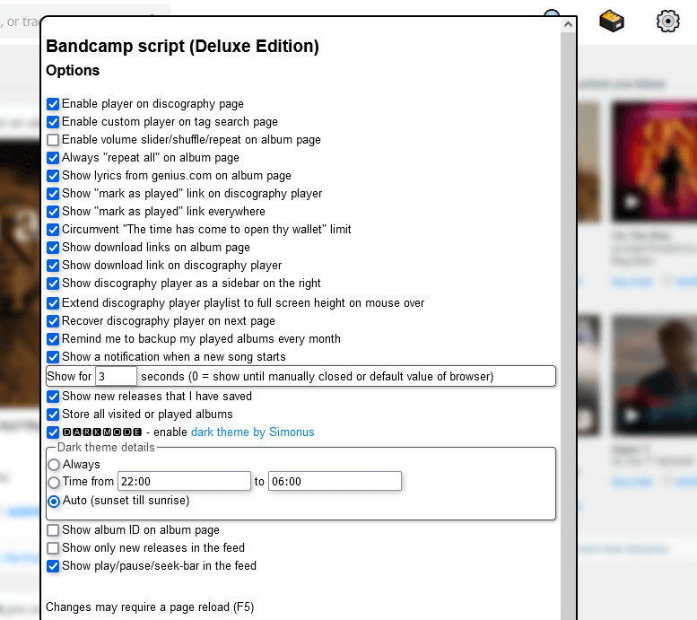

# Bandcamp script (Deluxe Edition)

A discography player for bandcamp.com and manager for your played albums

This is a userscript for your browser. It's primarily designed for Firefox and Chrome with
[Tampermonkey](https://www.tampermonkey.net/)  
or
[FireMonkey ](https://addons.mozilla.org/en-US/firefox/addon/firemonkey/).
General information about userscripts and how to use them can be found at [openuserjs.org/about/Userscript-Beginners-HOWTO](https://openuserjs.org/about/Userscript-Beginners-HOWTO).

If you already have a userscript extension installed, you can **[click to install](https://greasyfork.org/scripts/390404-bandcamp-script-deluxe-edition/code/Bandcamp%20script%20(Deluxe%20Edition).user.js)** this script.

This userscript runs on all websites (`// @include *`) because bandcamp pages can have custom domains ([discussion](../../issues/3)). If you don't want this feature, you can install the alternative version that only runs on bandcamp.com and campexplorer.io: **[Click to install alternative version](https://github.com/cvzi/Bandcamp-script-deluxe-edition/raw/master/dist/release-bandcamp.com-only.user.js)**.

Main features:
 *   **player on discography pages** (similar to the player on tag pages)
 *   **manage your 'played/listened' albums** by clicking on a '✔ Mark as played' link
 *   Export/backup played/listened albums
 *   circumvent the "The time has come to open thy wallet" limit
 *   Desktop notifications on song change (disabled by default, enable in script settings in the top right corner)
 *   Control playback with hardware multimedia keys or remote control
 *   **Set reminders** for upcoming releases
 *   **Dark theme** by [Simonus](https://userstyles.org/styles/171538/bandcamp-in-dark)
 *   **Lyrics from [genius.com](https://genius.com/)** on album pages if bandcamp does not provide lyrics
 *   Works on [campexplorer.io](https://campexplorer.io/)
 *   Settings to disable individual functions

Other features:
 *   Album page: Direct download link, if you already bought the album
 *   Album page: Hover over top-right corner of album art to play in "Discography player"
 *   Album page: Show release date in a custom format (disabled by default)
 *   Album page: Show album ID (disabled by default)
 *   Album page: Show a volume slider
 *   Album page: Shuffle/repeat option
 *   Feed: Show audio player controls (play/pause/seek) in bottom right corner
 *   Feed: Automatically play next item in feed when track ends
 *   Feed: "play album" link neyt to "buy now" to play album in "Discography player"
 *   Feed: Show only new album releases in the feed (disabled by default, enable in  script settings)
 *   Discography player: Show at the page bottom like bandcamp's player or as side bar
 *   Discography player: Add track or album to wishlist
 *   Discography player: Drag'n'Drop album links or urls into the playlist (e.g. from the url bar from another tab/window)
 *   Tag search: Search multiple tags with the 🔍 search in the navigation bar
 *   Tag search: Play albums in "Discography player"
 *   Search: Play search results in "Discography player"
 *   Download mp3 from discography player
 *   Download mp3 from album page

Discography player:

 *   The discography can also be opend from any album page: hover the mouse over the top right corner of the album art and a play button appears.
 *   In the feed you can open the player by clicking the "play album" link next to the "buy now" and "add to wishlist" button

Album page:

Dark theme album page:

Lyrics from genius.com on album page:

Discography player as a sidebar:

Options:

[Changelog](CHANGELOG.md)

[License](LICENSE)

## Donate

If you enjoy using this app, please consider donating, so I can spend more time implementing improvements.
 *   https://www.patreon.com/cuzi
 *   https://ko-fi.com/cuzicvzi
 *   https://liberapay.com/cuzi/
 *   https://buymeacoff.ee/cuzi
 *   https://flattr.com/@cuzi/github/cvzi
 *   https://bandcamp.com/cuzi/wishlist
