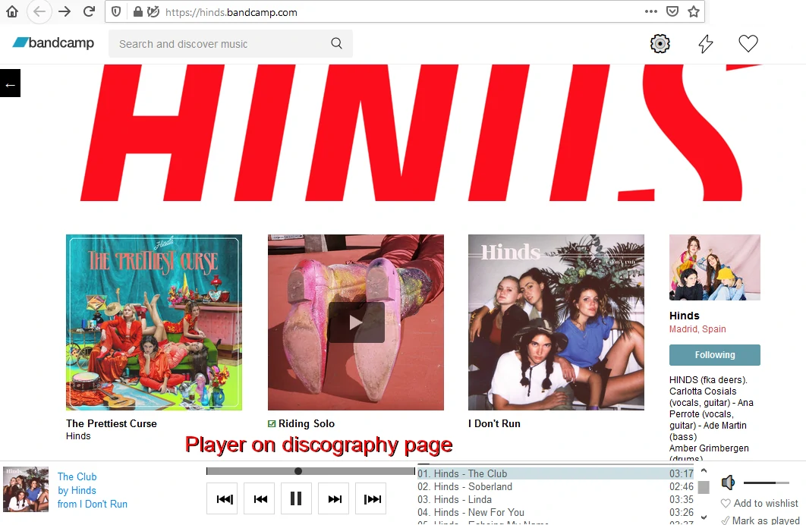
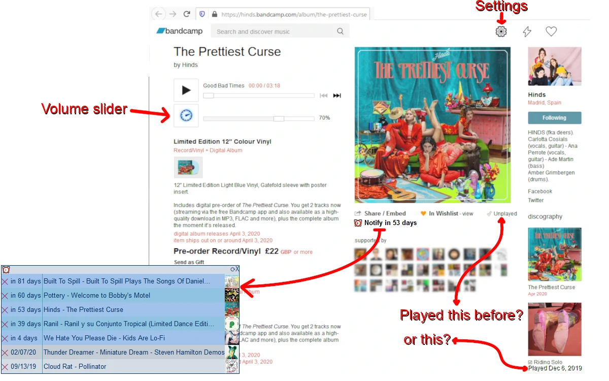

# Bandcamp-script-deluxe-edition

A discography player for bandcamp.com and manager for your played albums

This is a userscript. It's primarily designed for Firefox and Chrome with
[Greasemonkey](https://addons.mozilla.org/firefox/addon/greasemonkey/) 
,
[Tampermonkey](https://www.tampermonkey.net/)  
or
[FireMonkey](https://addons.mozilla.org/en-US/firefox/addon/firemonkey/) .
General information about userscripts and how to use them can be found at [openuserjs.org/about/Userscript-Beginners-HOWTO](https://openuserjs.org/about/Userscript-Beginners-HOWTO).

If you already have a userscript extension installed, you can **[click to install](https://openuserjs.org/install/cuzi/Bandcamp_script_(Deluxe_Edition).user.js)** this script.

This userscript runs on all websites (`// @include *`) because bandcamp pages can have custom domains e.g. https://shop.stereoscenic.com/music (Discussion: [issue #3](../../issues/3)). If you don't want this feature, you can install the alternative version that only runs on bandcamp.com and campexplorer.io: **[Click to install alternative version](https://github.com/cvzi/Bandcamp-script-deluxe-edition/raw/master/Bandcamp-script-Deluxe-Edition-Bandcamp.com-only.user.js)**. You will lose your played albums. You need to back-up from the settings menu in the installed script, disable the script, install the alternative version and restore them from the settings menu.

Features:
 *   player on discography pages (similar to the player on tag pages)
 *   manage your 'played/listened' albums by clicking on a '✔ Mark as played' link
 *   Export/backup played/listened albums
 *   circumvent the "The time has come to open thy wallet" limit
 *   volume slider on album pages
 *   shuffle/repeat on album page
 *   Download mp3 from discography player
 *   Download mp3 from album page
 *   Desktop notifications on song change (disabled by default, enable in script settings in the top right corner)
 *   Control playback with hardware multimedia keys or remote control (only Chrome)
 *   Set reminders for upcoming releases
 *   Minimize/Close player
 *   Settings to disable individual functions
 *   Works on [campexplorer.io](https://campexplorer.io/)
 *   Dark theme by [Simonus](https://userstyles.org/styles/171538/bandcamp-in-dark)

Discography player:

Album page:

[Changelog](CHANGELOG.md)

[License](LICENSE)
