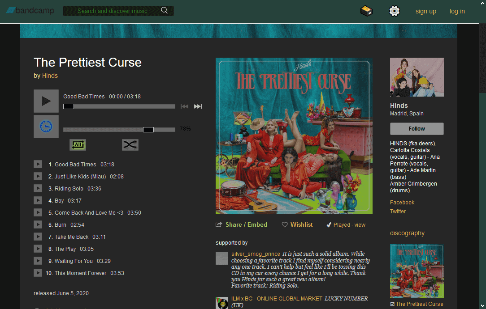
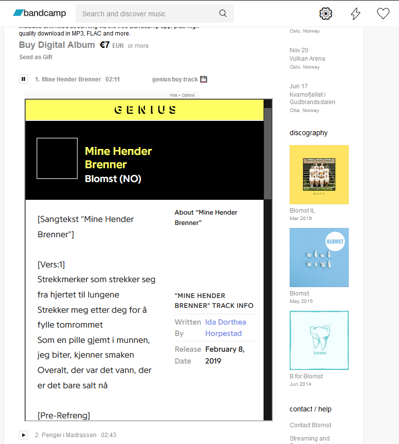
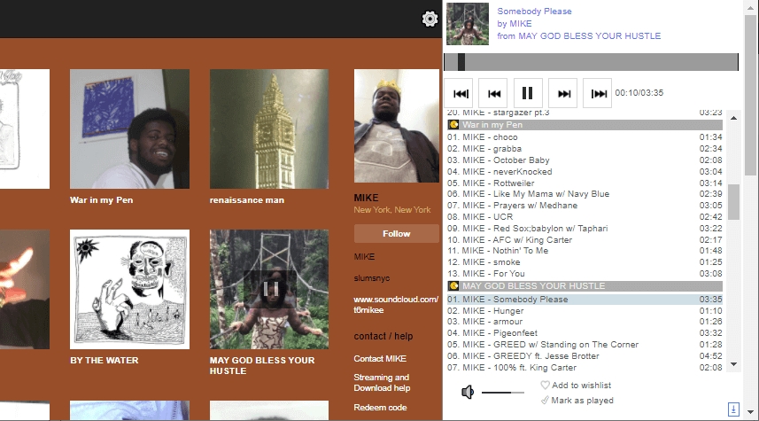

# Bandcamp script (Deluxe Edition)

A discography player for bandcamp.com and manager for your played albums

This is a userscript for your browser. It's primarily designed for Firefox and Chrome with
[Tampermonkey](https://www.tampermonkey.net/)  
or
[FireMonkey ](https://addons.mozilla.org/en-US/firefox/addon/firemonkey/).
General information about userscripts and how to use them can be found at [openuserjs.org/about/Userscript-Beginners-HOWTO](https://openuserjs.org/about/Userscript-Beginners-HOWTO).

If you already have a userscript extension installed, you can **[click to install](https://openuserjs.org/install/cuzi/Bandcamp_script_(Deluxe_Edition).user.js)** this script.

This userscript runs on all websites (`// @include *`) because bandcamp pages can have custom domains e.g. https://shop.stereoscenic.com/music ([discussion](../../issues/3)). If you don't want this feature, you can install the alternative version that only runs on bandcamp.com and campexplorer.io: **[Click to install alternative version](https://github.com/cvzi/Bandcamp-script-deluxe-edition/raw/master/dist/release-bandcamp.com-only.user.js)**.

Features:
 *   **player on discography pages** (similar to the player on tag pages)
 *   **manage your 'played/listened' albums** by clicking on a '✔ Mark as played' link
 *   Export/backup played/listened albums
 *   circumvent the "The time has come to open thy wallet" limit
 *   **volume slider** on album pages
 *   shuffle/repeat on album page
 *   Download mp3 from discography player
 *   Download mp3 from album page
 *   Desktop notifications on song change (disabled by default, enable in script settings in the top right corner)
 *   Control playback with hardware multimedia keys or remote control
 *   **Set reminders** for upcoming releases
 *   **Dark theme** by [Simonus](https://userstyles.org/styles/171538/bandcamp-in-dark)
 *   **Lyrics from [genius.com](https://genius.com/)** on album pages if bandcamp does not provide lyrics
 *   Settings to disable individual functions
 *   Works on [campexplorer.io](https://campexplorer.io/)

Discography player:

Album page:

Dark theme album page:

Lyrics from genius.com on album page:

Discography player as a sidebar:

[Changelog](CHANGELOG.md)

[License](LICENSE)

## Donate

If you enjoy using this app, please consider donating, so I can spend more time implementing improvements.
 *   https://www.patreon.com/cuzi
 *   https://ko-fi.com/cuzicvzi
 *   https://liberapay.com/cuzi/
 *   https://buymeacoff.ee/cuzi
 *   https://flattr.com/@cuzi/github/cvzi
 *   
 *   https://bandcamp.com/cuzi/wishlist
